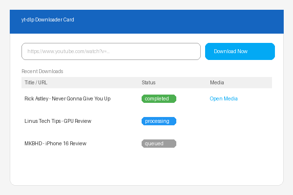

# ha-yt-dlp

🐳 Docker Compose yt-dlp API for Home Assistant with EJS (Node.js) support.  
Downloads to `/media/youtube_downloads` • Compatible with the `youtube_downloader` integration.

[](https://www.home-assistant.io/)
[](https://hub.docker.com/r/tarczyk/ha-yt-dlp/tags)
[](https://github.com/tarczyk/ha-yt-dlp/actions)
[](https://github.com/tarczyk/ha-yt-dlp/actions)
[](LICENSE)

## Features

- **Flask REST API** – `POST /download_video` and `GET /health`
- **yt-dlp** with Node.js as the JavaScript runtime (EJS) for YouTube 2025+ compatibility
- **ffmpeg** for post-processing (merging video/audio streams)
- **Volume** mounted at `/config/media` – visible in HA Media Browser
- **Multi-arch** image: `linux/amd64` and `linux/arm64` (aarch64 / Raspberry Pi)
- **Healthcheck** + `restart: unless-stopped` for reliable operation

## Quick Start

One command to get up and running:

```bash
git clone https://github.com/tarczyk/ha-yt-dlp.git
cd ha-yt-dlp
docker compose up -d --build
```

Check the logs to confirm the service is ready:

```bash
docker compose logs -f
```

Example output:

```
yt-dlp-api  |  * Running on http://0.0.0.0:5000
yt-dlp-api  |  * Serving Flask app 'app'
yt-dlp-api  |  * Debug mode: off
```

### Configuration

Adjust defaults by editing `.env` in the project root:

| Variable | Default | Description |
|---|---|---|
| `API_PORT` | `5000` | Host port for the Flask API |
| `DOWNLOAD_DIR` | `/config/media` | Host path where videos are saved |
| `YT_DLP_EXTRA_ARGS` | *(empty)* | Extra flags passed to `yt-dlp` |

### Test the API

```bash
# Health check
curl http://localhost:5000/health

# Download a video
curl -X POST http://localhost:5000/download_video \
     -H "Content-Type: application/json" \
     -d '{"url": "https://www.youtube.com/watch?v=dQw4w9WgXcQ"}'
```

## API Docs

| Method | Endpoint | Description |
|--------|----------|-------------|
| `GET` | `/health` | Returns `{"status": "healthy"}` with HTTP 200 when the service is healthy |
| `POST` | `/download_video` | Starts async download; returns `{"status": "processing", "task_id": "..."}` |
| `GET` | `/tasks` | Lists all download tasks |
| `GET` | `/tasks/<task_id>` | Returns the status of a specific task |
| `GET` | `/files` | Lists downloaded files in the media directory |

### `GET /health`

```json
{"status": "healthy"}
```

### `POST /download_video`

**Request**

```json
{"url": "https://www.youtube.com/watch?v=..."}
```

**Responses**

| Code | Body | Meaning |
|------|------|---------|
| `202` | `{"status": "processing", "task_id": "..."}` | Download queued successfully |
| `400` | `{"error": "..."}` | Missing or invalid request body |


## 🎨 HA Lovelace Card (NEW!)

A HACS-ready Lovelace card that connects directly to the ha-yt-dlp API.

### Install via HACS

1. **HACS → Frontend → ⋮ → Custom repositories**
2. Add: `https://github.com/tarczyk/ha-yt-dlp` → Category: **Lovelace**
3. Search for **yt-dlp Downloader Card** and install it.

### Add to your dashboard

```yaml
type: custom:yt-dlp-card
api_url: http://host.docker.internal:5000
title: YouTube Downloader
max_tasks: 10
```

### Configuration

| Option | Default | Description |
|--------|---------|-------------|
| `api_url` | `http://localhost:5000` | Base URL of the Flask API |
| `title` | `YouTube Downloader` | Card heading |
| `max_tasks` | `5` | Maximum rows shown in the task list |

### Card Features

- **URL input** – paste any YouTube link
- **📥 Download Now** – triggers `POST /download_video`
- **Status badge** – color-coded: Processing (blue) · Completed (green) · Failed (red)
- **Task list** – shows recent downloads (live-polled every 2 s)
- **Progress bar** – per-task live progress from `GET /tasks/:id`
- **Media link** – opens HA Media Browser at `/media/youtube_downloads`
- **Responsive** – mobile + desktop layout

### Screenshot



---

## Home Assistant Integration

Follow these numbered steps to set up a fully working yt-dlp integration with Home Assistant.

### Prerequisites

- Docker and Docker Compose installed on the host machine
- Home Assistant 2023.1 or newer
- Network connectivity from Home Assistant to the Docker host on port `5000`

---

### Step 1 – Clone and configure the project

```bash
git clone https://github.com/tarczyk/ha-yt-dlp.git
cd ha-yt-dlp
```

Open `.env` and confirm (or adjust) the settings:

```dotenv
API_PORT=5000
DOWNLOAD_DIR=/config/media
```

> **Note:** `DOWNLOAD_DIR` must point to a path that is also mounted inside the Home Assistant container (typically `/config/media`).

---

### Step 2 – Start the container

```bash
docker compose up -d
```

Verify the service is healthy:

```bash
curl http://localhost:5000/health
# {"status": "healthy"}
```

> **Different machines:** If Home Assistant and Docker run on **different hosts**, edit `docker-compose.yml` and change the port binding from `127.0.0.1:5000:5000` to `5000:5000` so that HA can reach the API over the network.  This exposes the port on all network interfaces — restrict access with a firewall rule (e.g. `ufw allow from <HA-IP> to any port 5000`) or place the API behind a reverse proxy (such as Nginx or Caddy) with authentication.

---

### Step 3 – Expose the download directory as a media source

Add `media_dirs` to `configuration.yaml` so that downloaded videos appear in the **Media Browser**:

```yaml
# configuration.yaml
homeassistant:
  media_dirs:
    youtube: /config/media
```

Restart Home Assistant. The `youtube` source will appear under **Media → My Media**.

---

### Step 4 – Add the REST command

Add the REST command to `configuration.yaml` so that automations can trigger downloads:

```yaml
# configuration.yaml
rest_command:
  download_youtube_video:
    url: "http://<docker-host>:5000/download_video"
    method: POST
    content_type: "application/json"
    payload: '{"url": "{{ url }}"}'
```

Replace `<docker-host>` with the IP address or hostname of the machine running Docker (`localhost` if both run on the same host).

Reload **Home Assistant Core configuration** (or restart HA) to apply the change.

---

### Step 5 – Add an input helper for the video URL

Create a text helper that lets you enter a URL through the UI or automations:

```yaml
# configuration.yaml
input_text:
  youtube_url:
    name: YouTube URL
    max: 1000  # YouTube URLs with extra query parameters can be long; 1000 chars is a safe upper bound
```

Reload HA configuration to make the helper available.

---

### Step 6 – Trigger a download

**From Developer Tools → Services:**

```yaml
service: rest_command.download_youtube_video
data:
  url: "https://www.youtube.com/watch?v=dQw4w9WgXcQ"
```

**From an automation** (calls the service when the `input_text` changes):

```yaml
automation:
  - alias: "Download YouTube video when URL is set"
    trigger:
      - platform: state
        entity_id: input_text.youtube_url
    condition:
      - condition: template
        value_template: "{{ trigger.to_state.state | length > 0 }}"
    action:
      - service: rest_command.download_youtube_video
        data:
          url: "{{ states('input_text.youtube_url') }}"
      - service: input_text.set_value
        target:
          entity_id: input_text.youtube_url
        data:
          value: ""
```

---

### Step 7 – Monitor download status (optional)

Add a REST sensor to track active tasks:

```yaml
# configuration.yaml
sensor:
  - platform: rest
    name: "YT-DLP Tasks"
    resource: "http://<docker-host>:5000/tasks"
    method: GET
    value_template: "{{ value_json | length }}"
    scan_interval: 10
```

Check individual task status:

```bash
curl http://localhost:5000/tasks
# [{"status": "completed", "url": "https://...", "title": "Rick Astley - Never Gonna Give You Up"}]
```

---

### Step 8 – Browse downloaded files

Once a download completes, the file appears in **Media → My Media → youtube** in the Home Assistant Media Browser.

**Docker logs** (`docker compose logs -f`):

```
yt-dlp-api  | [download] Destination: /config/media/Rick Astley - Never Gonna Give You Up.mp4
yt-dlp-api  | [download] 100% of   6.57MiB in 00:03
```

> 📁 Media Browser → My Media → youtube → `Rick Astley - Never Gonna Give You Up.mp4`

---

### Troubleshooting

| Problem | Solution |
|---------|----------|
| `curl: (7) Failed to connect` | Check that the container is running (`docker compose ps`) and that the port is reachable from HA |
| `{"error": "invalid url"}` | Make sure the URL starts with `http://` or `https://` |
| Files not appearing in Media Browser | Confirm `media_dirs` is set and HA was restarted; verify `DOWNLOAD_DIR` in `.env` matches the path in `configuration.yaml` |
| Download fails with "Sign in to confirm" error | Update yt-dlp inside the container: `docker compose pull && docker compose up -d` |
| Port not accessible from HA on another host | Change `127.0.0.1:5000:5000` to `5000:5000` in `docker-compose.yml` and restart the stack |

## Development

### Hot reload (watch mode)

Mount the source code into the container and enable Flask's debug mode for instant reloads on file changes:

```yaml
# docker-compose.override.yml
services:
  yt-dlp-api:
    environment:
      FLASK_DEBUG: "1"
    volumes:
      - .:/app               # mount local source
```

Then start with:

```bash
docker compose -f docker-compose.yml -f docker-compose.override.yml up --build
```

Flask will automatically reload whenever you save a file under `./app`.

### Multi-Arch Build

To push a multi-architecture image to a registry:

```bash
docker buildx create --use
docker buildx build \
  --platform linux/amd64,linux/arm64 \
  -t youruser/yt-dlp-ha-api:latest \
  --push .
```

## Security

### Container hardening

The image applies several hardening measures out of the box:

| Measure | Detail |
|---------|--------|
| **Non-root user** | The Flask process runs as an unprivileged user inside the container |
| **Read-only filesystem** | Only `/media/youtube_downloads` (the download volume) is writable |
| **No new privileges** | `security_opt: no-new-privileges:true` prevents privilege escalation |
| **Minimal base image** | Built on `python:3.12-slim` to reduce the attack surface |
| **Pinned dependencies** | `requirements.txt` pins exact package versions |

### Recommended `docker-compose.yml` security options

```yaml
services:
  yt-dlp:
    security_opt:
      - no-new-privileges:true
    read_only: true
    cap_drop:
      - ALL
    tmpfs:
      - /tmp
    volumes:
      - ./config/media:/config/media
```

### Vulnerability scanning

The image is scanned for known CVEs on every build using [Trivy](https://github.com/aquasecurity/trivy). Scan results are published as GitHub Actions artifacts. To run a scan locally:

```bash
trivy image tarczyk/ha-yt-dlp:latest
```

## 🏠 Home Assistant Add-on

This repository also works as an **HA Add-on repository** (the same repo provides both the API add-on and the Lovelace card).

### Install the add-on

1. In Home Assistant, go to **Settings → Add-ons → Add-on store → ⋮ → Repositories**.
2. Add: `https://github.com/tarczyk/ha-yt-dlp`
3. Find **yt-dlp API** in the store and click **Install**.

The add-on runs the Flask API on port `5000` and writes downloads to the HA `/media` share (visible in Media Browser).

> See [`yt-dlp-api/DOCS.md`](yt-dlp-api/DOCS.md) for full add-on documentation.

---

## License

MIT
